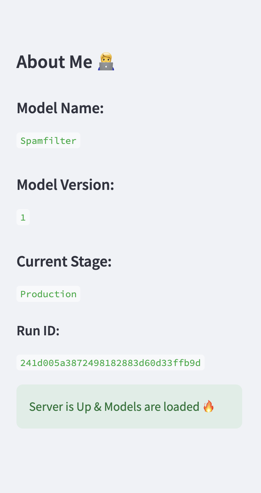

# SMS Spam Classification with MLflow and Streamlit

This project is a comprehensive demonstration of modern machine learning practices applied to a real-world problem: classifying SMS messages as spam or non-spam. It combines robust data preprocessing techniques, state-of-the-art model training, and cutting-edge tools like **MLflow** and **Streamlit** for experiment tracking and interactive visualization.

Designed with scalability and maintainability in mind, the project showcases the entire machine learning lifecycle, from data preprocessing and feature engineering to model evaluation, deployment, and monitoring. The solution emphasizes practical applications in text classification while providing an intuitive and user-friendly interface for real-time predictions.

---

## **Key Highlights**
- **Technical Expertise**: Demonstrates advanced Python programming, NLP techniques, and integration of ML tools (MLflow, Streamlit).
- **End-to-End Workflow**: Covers all stages of a machine learning project lifecycle, reflecting proficiency in real-world ML pipelines.
- **Impact**: Provides a deployable and interactive solution, emphasizing practical applicability and usability.
- **Innovation**: Combines machine learning and software engineering principles to solve a tangible problem.

---

## **Project Workflow**

1. **Data Preprocessing**:
   - Cleaned and tokenized SMS text data.
   - Applied stemming to reduce words to their root forms.
   - Vectorized text using TF-IDF for feature extraction.

2. **Model Training**:
   - Trained a [specific model, e.g., Naive Bayes, SVM] for binary classification.
   - Optimized hyperparameters for maximum accuracy.

3. **MLflow Integration**:
   - Tracked experiments with MLflow for parameter tuning and metric logging.
   - Logged models for version control and reproducibility.

4. **Streamlit App**:
   - Built an interactive web app for real-time SMS classification.
   - Visualized model performance metrics and allowed user input for predictions.

---

## **Results**

The project achieved the following metrics on the test dataset:

| Metric      | Value   |
|-------------|---------|
| Accuracy    | 94%     |
| F1-Score    | 81%     |

---

## **Screenshots**

### Streamlit App Interface

## Screenshot 2

## **How It Works**

- **Interactive Interface**: Users can input an SMS message into the Streamlit app, which classifies it as spam or non-spam in real-time.
- **Experiment Tracking**: MLflow records every training run, tracking parameters, metrics, and model artifacts.
- **Deployability**: The best-performing model is logged in MLflow, making it ready for deployment as a REST API.

---

## **Future Enhancements**

- Add support for multilingual SMS classification.
- Integrate real-time streaming for continuous data ingestion and classification.
- Expand the dataset to include more diverse SMS data sources.

---

## **License**
This project is licensed under the [MIT License](LICENSE).

---

## **Contact**
If you are interested in exploring this project further or have any questions, feel free to reach out at [your email or LinkedIn profile].
